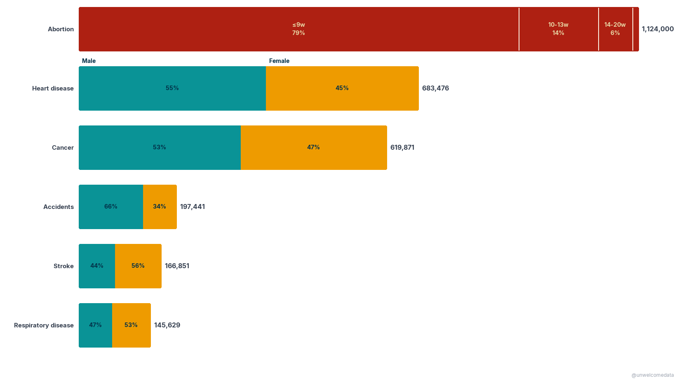
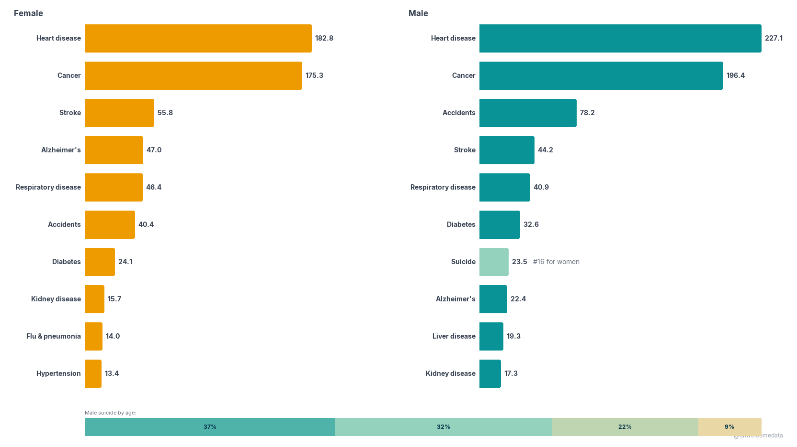
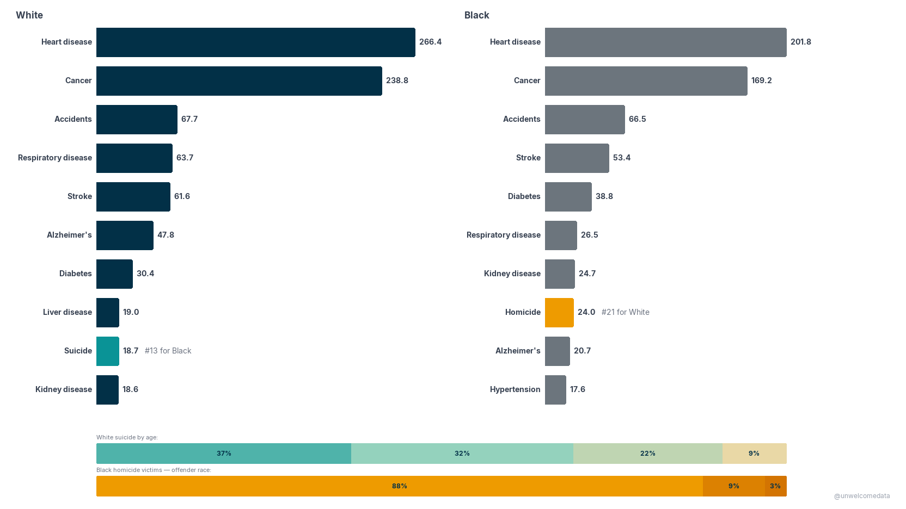
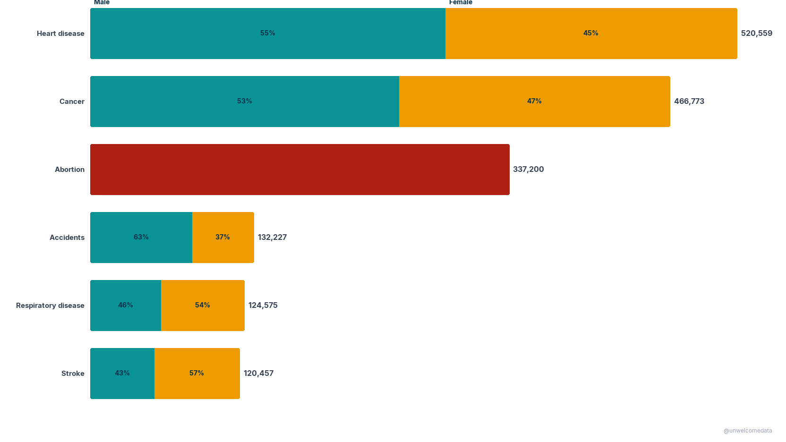
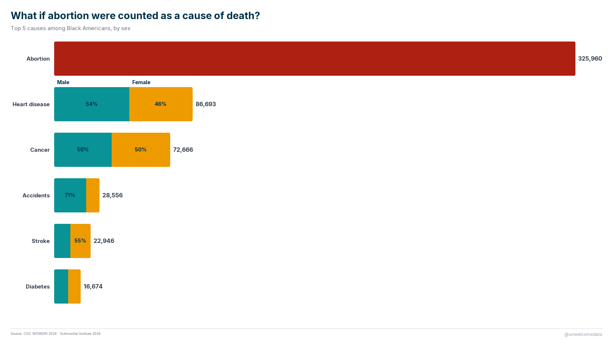
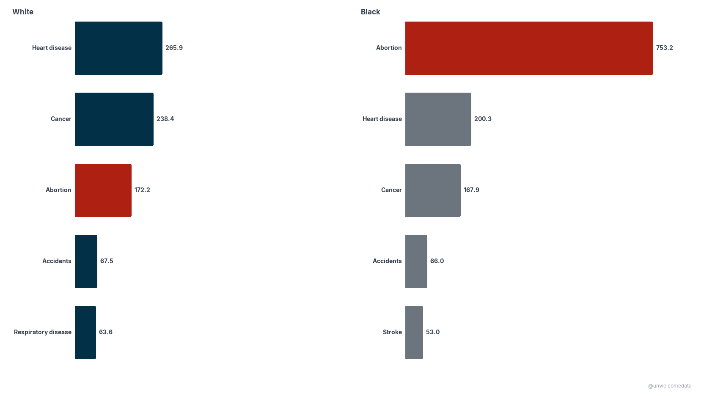

**[@unwelcomedata](https://unwelcomedata.github.io/abortion-cause-of-death/)** · data from public sources

# If abortion were counted as a cause of death, where would it rank?

A mortality comparison for the United States, 2024: the officially recorded
leading causes of death, and where the year's abortion total would fall **if it
were counted as a cause of death**.

**Up front about the framing.** This is a deliberate, contested comparison.
Abortions are not recorded on death certificates and are not in the mortality
data's universe — so the "with abortion" ranking is *constructed*, not drawn from
a single source. The point isn't to smuggle in a definition; it's to put a number
most people never see on the same axis as the causes of death they do. What you
conclude from that is yours. The construction, the denominator choice, and every
source are documented openly below and in [SOURCES.md](SOURCES.md).

---

## The charts

**What if abortion were counted as a cause of death?** The national top causes,
with the abortion total inserted and the list re-ranked.



**Top 10 causes of death: Female vs Male.** The recorded leading causes, by sex,
for context on the population the abortion figure sits against.



**Top 10 causes of death: White vs Black.** Recorded leading causes by race.



**The same comparison, within groups.** The "what if abortion were counted"
ranking computed among White Americans and among Black Americans.





**Per-capita: White vs Black.** Abortion as a rate per 100,000, on a shared scale.



> **Additional charts are available in the repo.** The [`docs/`](docs/) folder
> also includes White-vs-Hispanic, Black-vs-Hispanic, and three-way
> comparisons, plus the matching per-capita views — browse them in the repository
> even though they aren't all shown on this page.

---

## How it was measured

Three sources are combined:

- **Recorded deaths and population** — CDC WONDER 2024 (Underlying Cause of Death,
  Expanded), the standard federal mortality tabulation. Every death certificate
  gets one underlying cause; population denominators are Census estimates matched
  to the year.
- **The abortion total** — Guttmacher Institute's 2024 estimate (~1.12 million
  clinician-provided abortions).
- **Age & gestational-age shape** — CDC Abortion Surveillance 2022 distributions,
  the most recent with that detail, applied to the 2024 total.

**The denominator choice, stated plainly.** For the "with abortion" rates, the
denominator is `population + abortions`, so aborted lives are counted in the base
— consistent with how a crude death rate treats people who died. That's a modeling
choice; it's spelled out in [SOURCES.md](SOURCES.md) → Methodology Notes so you can
disagree with it explicitly.

**Caveats that materially affect interpretation:**

- The Guttmacher figure is a **model estimate (MAPS), not a census**, and it
  *excludes* self-managed abortions and abortions in total-ban states — so it is an
  **undercount** of all abortions occurring. It's also a different instrument from
  Guttmacher's older Abortion Provider Census (a method break at 2023): a
  "2020 vs 2024" comparison mixes a census with a model.
- **Gestational-age and age distributions are 2022**, applied to 2024 on the
  assumption they move slowly (historically under a percentage point per year).
- Race counts use CDC's **single-race coding, which only runs 2018 forward** — do
  not splice onto older bridged-race series.

Per-source collection methods, definitions, series breaks, and known controversies
are all in [SOURCES.md](SOURCES.md).

---

## The data

The published dataset is in [`export/`](export/):

- `abortion_cause_of_death_v1.csv` — 63 rows across three populations (National,
  Female, Female 15-44) under both scenarios (with / without abortion), × 14
  columns.
- `abortion_cause_of_death_v1_codebook.md` — a plain-English description of every
  column.

The richer packaging (Excel, Parquet) and the full pipeline code are in the repo.

---

## Reproduce it

**This one is not a one-command rebuild, and it shouldn't pretend to be.** Two of
the three sources are manual downloads — CDC WONDER is an interactive query tool
with no bulk API, and the Guttmacher total comes from a published fact sheet. Once
those raw files are in place (exact queries and filenames are in
[SOURCES.md](SOURCES.md)), the ingest → clean → prepare pipeline builds the DuckDB
tables and the export is rebuilt with:

```bash
python scripts/generate_export.py    # DuckDB tables → export/ (CSV)
```

The honest run order — including the manual steps — is in
[`scripts/README.md`](scripts/README.md), and the reusable logic is in
[`src/`](src/).

---

## Sources & license

Full attribution — publisher, URL, collection method, definitions, series breaks,
and known controversies — is in [SOURCES.md](SOURCES.md). In short: CDC WONDER
2024 and CDC Abortion Surveillance 2022 (public domain, U.S. government), and the
Guttmacher Institute 2024 estimate (published research, cited for analysis). No
crowd-edited sources are used.

---

## Further exploration

- A time series across 2018–2024 (staying within the single-race break) rather
  than a single year.
- Sensitivity of the ranking to the denominator choice (population vs
  population + abortions).
- An explicit self-managed-abortion adjustment band around the Guttmacher
  undercount.

---

> **AI-Assisted Development**
> This project was built with the assistance of [Kiro](https://kiro.dev), an
> AI-powered development environment. All data-sourcing decisions, methodology
> choices, and published findings are the responsibility of the author. AI was
> used for code generation, data-pipeline construction, and research assistance —
> not for analysis conclusions or editorial judgment.
